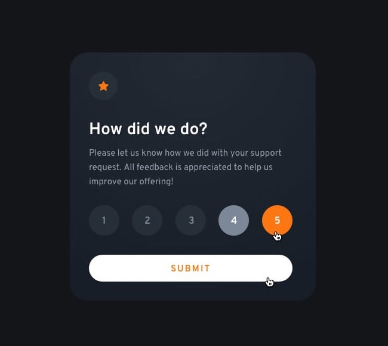
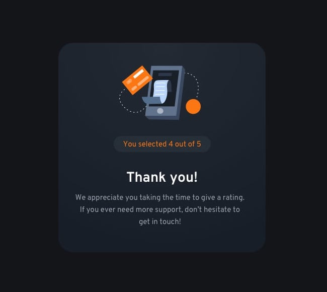

<div align="center">
  
</div>

## Table of contents

- [Overview](#overview)
  - [Links](#links)
  - [The challenge](#the-challenge)
- [My process](#my-process)
  - [Built with](#built-with)
  - [What I learned](#what-i-learned)
  - [Continued development](#continued-development)
  - [Useful resources](#useful-resources)
- [Author](#author)

## Overview

### Links

- View live page: [Interactive rating component](https://rileydevdzn.github.io/js-ratings-form/)

### The challenge

Users should be able to:

- View the optimal layout for the app depending on their device's screen size
- See hover states for all interactive elements on the page
- Select and submit a number rating
- See the "Thank you" card state after submitting a rating

<div align="center">
  
  
  <p><em>Active and 'thank you' state designs</em></p>
</div>

This is a solution to the [Interactive rating component challenge on Frontend Mentor](https://www.frontendmentor.io/challenges/interactive-rating-component-koxpeBUmI).

## My process

### Built with

- Semantic HTML5 markup
- CSS variables
- Flexbox and CSS functions for a media query-less build (responsive design)
- Iterating over a set of radio buttons to identify selected rating and manipulating `classList` with JavaScript to show thank you message
- Realistic workflow, building from professional Figma design files (design-to-code) 

### What I learned

Since users were asked to select a rating from a list of options and could only choose one option at a time, I used a set of radio buttons `<input type="radio'>` in a `<form>` element for the ratings and a `<button type="button">` to manipulate the elements with JavaScript. This allowed me to show and update the thank you message with the selected rating on submission in a few lines of code.

I used `addEventListener` and `classList` to toggle the display property for the initially hidden (display: none) thank you message.

I then iterated through the set of radio buttons with a `for...of` loop to identify which radio button was checked (selected) and used that value to update the rating confirmation part of the thank you message.

```js
let selectedRating;
  for (const radioButton of radioButtons) {
    if (radioButton.checked) {
      selectedRating = radioButton.value;
      break;
    }
  }
  yourRating.innerText = `You selected ${selectedRating} out of 5`;
```

### Continued development

This was a good project for simple DOM manipulation using JavaScript. It also reinforced choosing semantically accurate HTML elements to optimize the amount of JavaScript needed with a simple, effective solution. I implemented what I've learned from responsive design projects so far to create a media query-less design in this project, and I'll continue to iterate, learn, and build more projects to further improve my front-end skills. 

### Useful resources

- [Javascript.info](https://javascript.info/) - This  is a great resource for learning and improving with JavaScript with plain-language explanations and examples. 
- [JavaScriptTutorial.net](https://www.javascripttutorial.net/) - A good compliment to the previous resource, this one takes a slightly different approach and includes additional tutorials for common tasks like manipulating elements and properties.

## Author

- Frontend Mentor - [@rileydevdzn](https://www.frontendmentor.io/profile/rileydevdzn)
